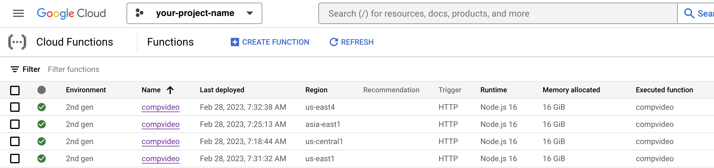

# movie compressor using FFMpeg

## Google cloud function



## After deployment to GoogleCloud Function

1. make sure your credential key is set.

```.sh
gcloud auth print-identity-token
```

2. try API call with `itr` and `offset` queries.
```.sh
curl -X GET https://compvideo-2kpkrvrjda-uc.a.run.app\?itr\=1\&offset\=0 \
-H "Authorization: Bearer $(gcloud auth print-identity-token)"
```

3. sequential API call with `seq` and `xargs` shell script.

```.sh
seq 0 10 100|xargs -n 1 -P 50 -I {} \
curl -X GET https://compvideo-2kpkrvrjda-uc.a.run.app\?itr\=10\&offset\=\{\} \
-H "Authorization: Bearer $(gcloud auth print-identity-token)"
```

